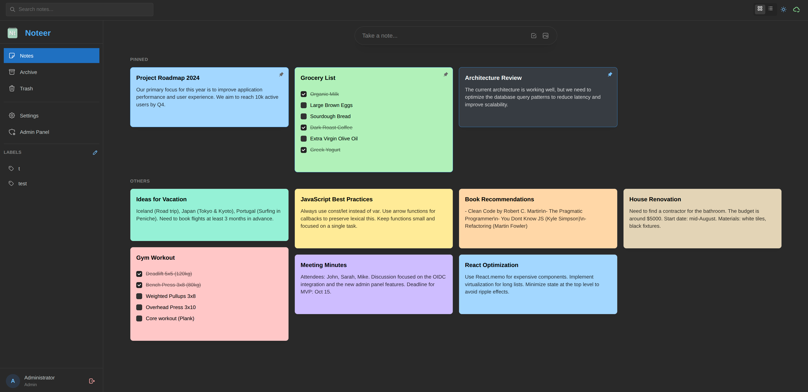

<div align="center">

# 📝 Noteer

**A modern, self-hosted notes application**

[](https://github.com/bigtcze/noteer/pkgs/container/noteer)
[](https://github.com/bigtcze/noteer/releases)
[](LICENSE)
[](https://github.com/bigtcze/noteer/actions/workflows/ci.yml)



</div>

---

## ✨ Features

- 📋 **Notes & Checklists** - Create notes with rich text and interactive checklists
- 🏷️ **Labels** - Organize notes with customizable labels
- 📌 **Pin & Archive** - Pin important notes, archive completed ones
- 🎨 **Color Coding** - 11 beautiful colors to categorize your notes
- 🌓 **Dark & Light Mode** - Easy on the eyes, day or night (dark mode default)
- 🔒 **Secure Authentication** - Local login or OIDC (Authentik, Authelia, PocketID, etc.)
- 👥 **Multi-user** - Admin and user roles with full access control
- 🐳 **Single Container** - Everything runs in one Docker container
- 📱 **Responsive Design** - Works beautifully on desktop and mobile
- 🔐 **SSL/TLS Ready** - Use with reverse proxy or direct HTTPS

---

## 🚀 Quick Start

### Docker Run

```bash
docker run -d \
  --name noteer \
  -p 3000:3000 \
  -v noteer-data:/var/lib/postgresql/data \
  -e ADMIN_EMAIL=admin@example.com \
  -e ADMIN_PASSWORD=your-secure-password \
  ghcr.io/bigtcze/noteer:latest
```

Open [http://localhost:3000](http://localhost:3000) and login with your admin credentials.

### Docker Compose

```yaml
version: "3.8"

services:
  noteer:
    image: ghcr.io/bigtcze/noteer:latest
    container_name: noteer
    restart: unless-stopped
    ports:
      - "3000:3000"
    volumes:
      - noteer-data:/var/lib/postgresql/data
    environment:
      - ADMIN_EMAIL=admin@example.com
      - ADMIN_PASSWORD=your-secure-password
      # Optional OIDC
      # - OIDC_ENABLED=true
      # - OIDC_ISSUER_URL=https://auth.example.com
      # - OIDC_CLIENT_ID=noteer
      # - OIDC_CLIENT_SECRET=your-client-secret

volumes:
  noteer-data:
```

---

## ⚙️ Configuration

### Environment Variables

| Variable | Default | Description |
|----------|---------|-------------|
| `PORT` | `3000` | Application port |
| `ADMIN_EMAIL` | `admin@example.com` | Admin user email |
| `ADMIN_PASSWORD` | `changeme` | Admin user password |
| `OIDC_ENABLED` | `false` | Enable OIDC authentication |
| `OIDC_ISSUER_URL` | - | OIDC provider URL |
| `OIDC_CLIENT_ID` | - | OIDC client ID |
| `OIDC_CLIENT_SECRET` | - | OIDC client secret |
| `OIDC_REDIRECT_URI` | - | OIDC callback URL |
| `SSL_ENABLED` | `false` | Enable direct HTTPS |
| `SSL_CERT_PATH` | - | Path to SSL certificate |
| `SSL_KEY_PATH` | - | Path to SSL key |

### Reverse Proxy (Recommended)

<details>
<summary>Traefik</summary>

```yaml
labels:
  - "traefik.enable=true"
  - "traefik.http.routers.noteer.rule=Host(`notes.example.com`)"
  - "traefik.http.routers.noteer.entrypoints=websecure"
  - "traefik.http.routers.noteer.tls.certresolver=letsencrypt"
  - "traefik.http.services.noteer.loadbalancer.server.port=3000"
```
</details>

<details>
<summary>Nginx Proxy Manager</summary>

1. Add new proxy host
2. Domain: `notes.example.com`
3. Forward Hostname: `noteer` (container name)
4. Forward Port: `3000`
5. Enable SSL with Let's Encrypt
</details>

<details>
<summary>Caddy</summary>

```caddyfile
notes.example.com {
    reverse_proxy noteer:3000
}
```
</details>

### Direct HTTPS (without reverse proxy)

Mount your certificates and enable SSL:

```bash
docker run -d \
  --name noteer \
  -p 443:3000 \
  -v noteer-data:/var/lib/postgresql/data \
  -v /path/to/cert.pem:/certs/cert.pem:ro \
  -v /path/to/key.pem:/certs/key.pem:ro \
  -e SSL_ENABLED=true \
  -e SSL_CERT_PATH=/certs/cert.pem \
  -e SSL_KEY_PATH=/certs/key.pem \
  ghcr.io/bigtcze/noteer:latest
```

---

## 🗺️ Roadmap

### 🛡️ Admin Panel (Coming Soon)
- [ ] 👥 User management (create, delete, password reset)
- [ ] ⬆️ Promote/demote users to admin role
- [ ] 💾 Disk space limits per user
- [ ] 🔒 Admin privacy: cannot view user notes

### 📱 Mobile Apps (Planned)
- [ ] 🤖 Android app (native)
- [ ] 🍎 iOS app (native)
- [ ] 📲 PWA support

### 🔧 Features (Planned)
- [ ] 🔔 Reminders & notifications
- [ ] 🖼️ Image attachments
- [ ] 🤝 Note sharing & collaboration
- [ ] 🔍 Advanced search with filters
- [ ] 📤 Export (Markdown, PDF)
- [ ] 🔄 Offline sync
- [ ] 🏷️ Nested labels

---

## 🛠️ Development

### Prerequisites

- Node.js 20+
- PostgreSQL 16+ (or use Docker)

### Setup

```bash
# Clone the repository
git clone https://github.com/bigtcze/noteer.git
cd noteer

# Install backend dependencies
cd backend
npm install
cp .env.example .env  # Edit with your settings

# Install frontend dependencies
cd ../frontend
npm install

# Start development servers
cd ../backend && npm run dev  # Terminal 1
cd ../frontend && npm run dev  # Terminal 2
```

### Testing

```bash
# Run Playwright E2E tests
npx playwright test
```

---

## 📄 License

Apache License 2.0 - see [LICENSE](LICENSE) for details.

---

<div align="center">

Made with ❤️ for the self-hosted community

[Report Bug](https://github.com/bigtcze/noteer/issues) · [Request Feature](https://github.com/bigtcze/noteer/issues)

</div>
